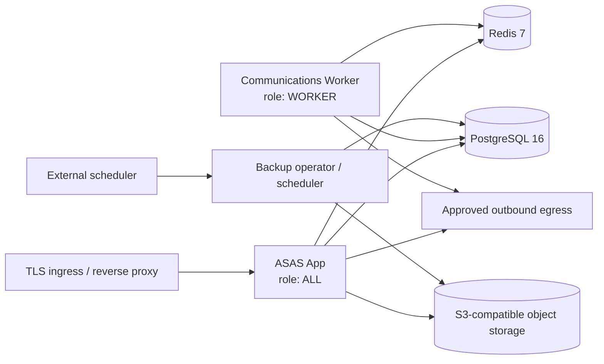

# ASAS Plus — W01 Deployment Support Matrix and Runbook

**النطاق:** `DEP-001` فقط. يصف هذا المستند نواة واحدة قابلة للدعم عبر Cloud وDedicated وSelf-Hosted، ولا ينفذ W02 licensing أو tenant migration أو installer تجاري كامل.

## Deployment Topology

تتضمن compose topology خدمة `app` وخدمة `worker` مستقلتين. يعمل التطبيق بدور `ALL` لكي يراقب heartbeat العامل المستقل من Redis، بينما يعمل العامل بدور `WORKER` فقط. يملك Dockerfile stage مخصصاً للعامل ولا يفترض أن web runtime هو العامل.

## Supported Environment Matrix

| المكوّن | Cloud / SaaS | Dedicated | Self-Hosted | أين يعمل | المالك والمدير | المراقبة | التحديث | مسؤولية ASAS | مسؤولية العميل |
|---|---|---|---|---|---|---|---|---|---|
| App | مدعوم | مدعوم | مدعوم | container `app` خلف TLS ingress | ASAS في SaaS؛ حسب العقد في Dedicated؛ العميل في Self-Hosted | `/api/health` وlogs المنقحة | signed artifact وفق release plan | artifact، contracts، runbook | شبكة/ingress في البيئات العميلة |
| Worker | مدعوم كخدمة `worker` مستقلة | مدعوم | مدعوم | container/process مستقل بدور `WORKER` | كالـApp بحسب edition | Redis heartbeat وHealth app | نفس release version للـApp | worker contract وhealth semantics | تشغيل worker واستمراريته عند ownership العميل |
| PostgreSQL | 16+ مدعوم | 16+ مدعوم | 16+ مدعوم | service managed أو container خارجي | ASAS/مشترك/عميل حسب edition | DB probe وprovider monitoring | migration plan توسعية فقط | Prisma compatibility/migration policy | availability، credentials، backup عند ownership العميل |
| Redis | 7+ مدعوم | 7+ مدعوم | 7+ مدعوم | service managed أو container خارجي | حسب edition | `PING` وQueue/heartbeat | compatible release plan | Redis/BullMQ contracts | service operation عند ownership العميل |
| Object Storage | S3-compatible إلزامي للإنتاج | S3-compatible | S3-compatible | مزود خارجي أو MinIO مدعوم | حسب responsibility matrix | provider probe + upload/checksum evidence | provider lifecycle خارج artifact | integration contract وpreflight | bucket/keys/retention عند ownership العميل |
| Backup | managed policy | shared/contractual | customer-operated مع ASAS runbook | artifact في audit/production storage منفصل | ASAS/SHARED/CUSTOMER | manifest، checksum، verifiedAt، Health | pre-update gate | verification contract/recovery runbook | إنشاء/حفظ artifact وفق ownership |
| Scheduler | external deterministic scheduler | external scheduler | system scheduler أو managed scheduler | خارج App/Worker حتى يوجد adapter صريح | حسب edition | preflight يعلن `NOT_CONFIGURED` عند غياب adapter | خارج release artifact | interface/runbook، لا نجاح زائف | تشغيل scheduler عند ownership العميل |
| TLS | managed ingress | customer/managed ingress | customer ingress | reverse proxy/load balancer | حسب edition | certificate/endpoint monitoring | ingress lifecycle | HTTPS requirement في preflight | certificate/DNS عند ownership العميل |
| Egress | approved network policy | agreed allow-list | customer firewall/allow-list | App/Worker outbound network | حسب edition | configured probe URL في preflight | network policy خارج artifact | probe contract/required endpoints | firewall/DNS/proxy rules عند ownership العميل |

## Ownership and Support Boundary

لا يملك Control Plane بيانات المستفيدين أو المعاملات أو credentials. لا يغير ASAS بنية العميل دون عقد تشغيل واضح. في Self-Hosted، يظل العميل مسؤولاً عن host/network/storage/backup execution، بينما يوفر ASAS artifact، contracts، preflight، verification، وتوافق الاستعادة. في Dedicated، تقسم المسؤوليات بعقد دعم؛ وفي SaaS، يدير ASAS الخدمات مع احترام حدود data plane.

## Deployment Runbook

| المرحلة | الإجراء | دليل النجاح | مسار الفشل الآمن |
|---|---|---|---|
| 1. تحضير البيئة | وفّر Node 20+، PostgreSQL 16+، Redis 7+، Storage endpoint، TLS وegress rules | `check:env` وpreflight لا يكشفان secrets | توقف قبل migration أو تشغيل الخدمات |
| 2. نشر artifact | تحقق من manifest الموقّع وchecksum ثم شغّل App وWorker من release متوافق | App وWorker على release version نفسه | ارفض artifact أو version غير متوافق |
| 3. dependencies | ابدأ Postgres وRedis ثم Worker ثم App؛ لا تمرر credentials في logs | DB/Redis probes وworker heartbeat | Health يعلن UNAVAILABLE/DEGRADED بصدق |
| 4. preflight | شغّل preflight read-only مع storage/egress probe URLs المدعومة | تقرير timestamped قابل للتنزيل | عالج dependency أو سجل NOT_CONFIGURED؛ لا تدّع الجاهزية |
| 5. backup/update | أنشئ backup حقيقياً، تحقق checksum/manifest، ثم نفذ update rehearsal | verifiedAt وHealth evidence | حظر update واستخدام recovery runbook |
| 6. تشغيل مستمر | راقب Health والـlogs وheartbeat | no false green وcorrelation IDs | عزل dependency الفاشل وحفظ evidence |

## Audit Environment Scope

بيئة التدقيق الحالية تستخدم PostgreSQL وRedis محليين حقيقيين، وMinIO S3-compatible محلياً على loopback لتخزين artifact التدقيق فقط. لا يمثل ذلك نشر إنتاجي ولا يكشف audit credentials أو ملفات backup في Git.
